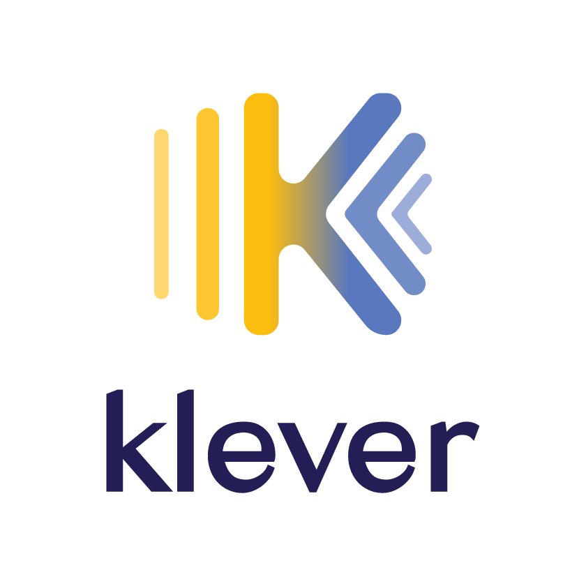
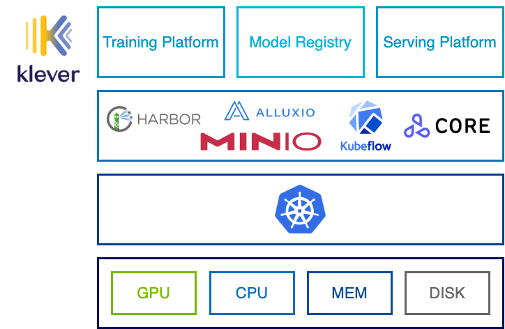

Klever is a cloud native platform for machine learning workloads. It help users to train, distribute, manage and serve their machine learning models. Klever is built on top of many state-of-art open source projects like [Kubeflow][], [Harbor][] and so on. Its current components are:

- [ormb][]: A CLI and a library to help users manage machine learning models like Docker images.
- [Model registry][]: A centralized registry, set of APIs and UI ( Will be added soon ) for machine learning models, based on [Harbor][] and [ormb][].
- Serving platform: A platform to deploy models in the model registry with the help of [Seldon Core][].

Components to be added:

- **Training platform**.

## Architecture

## Roadmap

Please have a look at [Roadmap](./docs/roadmap.md).

[Kubeflow]: https://github.com/kubeflow/kubeflow
[Harbor]: https://github.com/goharbor/harbor
[ormb]: https://github.com/kleveross/ormb
[Model registry]: https://github.com/kleveross/klever-model-registry
[Seldon Core]: https://github.com/SeldonIO/seldon-core
